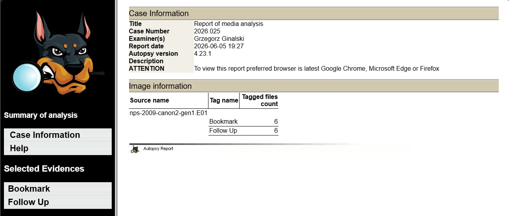
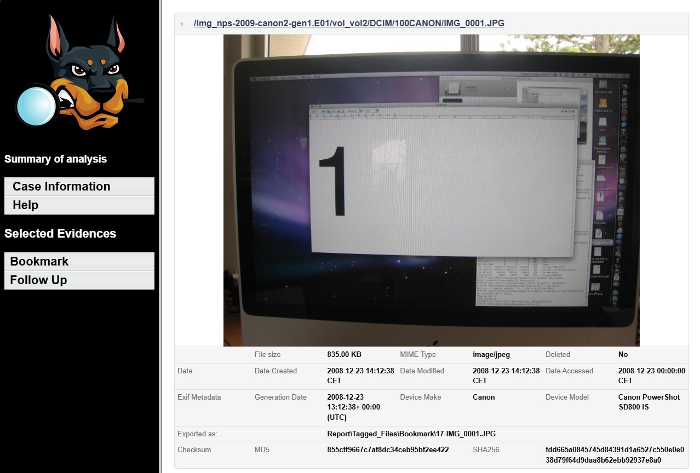
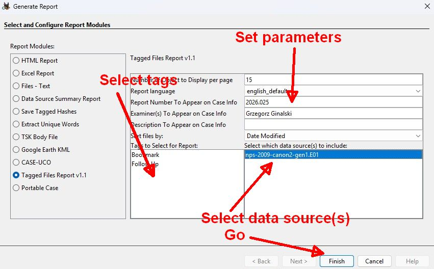

# Tagged Files Report Module for Autopsy

A report module for [Autopsy](https://www.autopsy.com/) that generates a structured HTML report of all tagged files in a case. Each file is presented with its metadata, EXIF data, GPS coordinates, checksums, and an inline preview — making it easy to review evidence directly in a browser.


## Features

### File Metadata & EXIF Data
For each tagged file the report includes:
- File name, size, MIME type
- Timestamps: date created, modified, accessed
- Deleted file indicator (including carved files)
- MD5 and SHA-256 checksums
- EXIF metadata for images: device make, device model, date taken
- GPS coordinates (latitude, longitude, altitude) with a Google Maps link
## Screenshots

**Case Information page** — summary of data sources, tags and tagged file counts:



**Evidence preview** — file with metadata, EXIF data and inline media preview:



**Report settings panel** — configuration options inside Autopsy:



### Media Preview in the Browser
Files are exported to the report folder and displayed inline in the HTML report:
- **Images** — displayed directly (``)
- **Video** — played in the browser (`<video>`) for natively supported formats (MP4, WebM, OGG)
- **Audio** — played in the browser (`<audio>`) for supported formats
- **PDF** — embedded inline (`<embed>`)
- **Text / scripts** — displayed in an iframe

### File Conversion for Unsupported Formats
Formats not natively supported by browsers are automatically converted for preview:

| Original format | Converted to | Tool used |
|---|---|---|
| MOV, WMV, MPEG, MKV, AVI | MP4 (H.264 / AAC) | ffmpeg |
| HEIC, HEIF, SVG | JPG | ImageMagick |

Converted files are saved to a `preview/` subfolder inside the report directory.

### Case Summary
The report's Info page includes a summary table showing:
- All selected data sources (evidence images)
- For each data source: which tags were selected and how many files were tagged under each

### Configurable Settings (`settings.ini`)
The module stores user preferences in a `settings.ini` file located in the module directory. Settings are loaded at startup and saved automatically during report generation.

```ini
[Paths]
# Override default tool paths if needed.
# Remove the '#' and enter your own path to activate.
imagemagick = # C:\path\to\ImageMagick\magick.exe
ffmpeg = # C:\path\to\ffmpeg\bin\ffmpeg.exe

[Others]
num_of_tags_per_page = 10
```

If the paths are commented out (prefixed with `#`), the module falls back to the bundled tools included in the module directory.

### Additional Options
- Number of files per report page (configurable)
- Sorting of tagged files (by name, date, etc.)
- Multi-language support for report labels
- Report number, examiner name, and description fields (pre-filled from the Autopsy case)

---

## Requirements

- Autopsy 4.x (Jython / Python 2.7)
- ffmpeg — required for video conversion *(bundled or configured via `settings.ini`)*
- ImageMagick — required for HEIC/HEIF/SVG conversion *(bundled or configured via `settings.ini`)*

---

## Installation

1. Copy the `Tagged_Files_Report_module` folder to:
   ```
   %AppData%\autopsy\dev\python_modules\
   ```
2. Restart Autopsy.
3. The module will appear under **Generate Report → Tagged Files Report**.

---

## License

This is free and unencumbered software released into the public domain (The Unlicense).  
See source file header for full license text.

---

## Author

Grzegorz Ginalski
